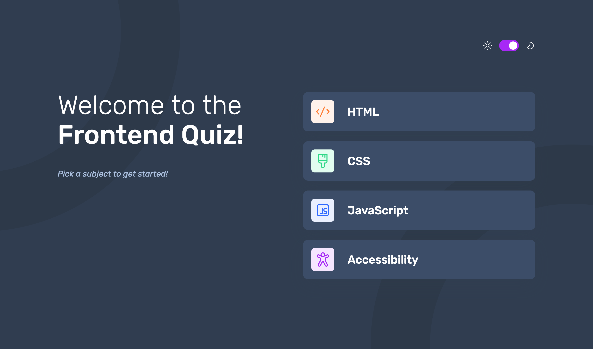

# Frontend Quiz App

This is a solution to the [Frontend quiz app challenge on Frontend Mentor](https://www.frontendmentor.io/challenges/frontend-quiz-app-BE7xkzXQnU). Frontend Mentor challenges help you improve your coding skills by building realistic projects.

## About the Project

The **"Frontend Quiz App"** is an educational tool designed to enhance users' knowledge in various frontend technologies.

_Initially constructed with Next.js 14 Pages Router_, this project has been transitioned to a _Client-Side Rendered (CSR) application using React and Vite_.

This project was part of my learning journey with React and Next.js, so some coding decisions reflect an amateur approach, showcasing the evolution of my skills over time.

## Preview and Links

- [**Live Demo URL**](https://ionstici.github.io/dictionary-web-app)
- [**Frontend Mentor**](https://www.frontendmentor.io/solutions/frontend-quiz-app-INFx-A-C0X)

## Features

- **Theme Switching:** Users can toggle between dark and light themes for comfort based on their environment or preference.
- **Quiz Selection:** Choose from quizzes on HTML, CSS, JavaScript, or Accessibility (A11y), each containing 10 questions.
- **Immediate Feedback:** Receive instant feedback on the correctness of each answer during the quiz.
- **Score Summary:** At the conclusion of a quiz, users are presented with their score, indicating how many questions they answered correctly.
- **Client-Side Rendering:** Built as a CSR app for a dynamic user experience.
- **Responsive Design:** Styled with Scss to ensure the app looks good on all devices.

## Built with

- **`React`:** For building the interactive quiz interface.
- **`Vite`:** To enhance development speed.
- **`react-router-dom`:** For smooth navigation between different quiz sections.
- **`Scss`:** For efficient, modular styling.
- **`react-helmet-async`:** For managing SEO-friendly metadata dynamically.
- **`TypeScript`:** To provide type safety and improve code quality.

## Deployment

This project is hosted on **GitHub Pages**.
